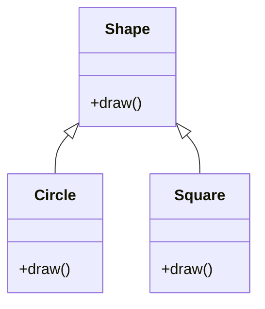
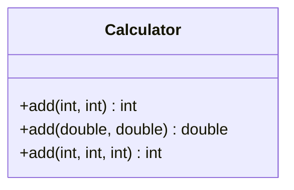
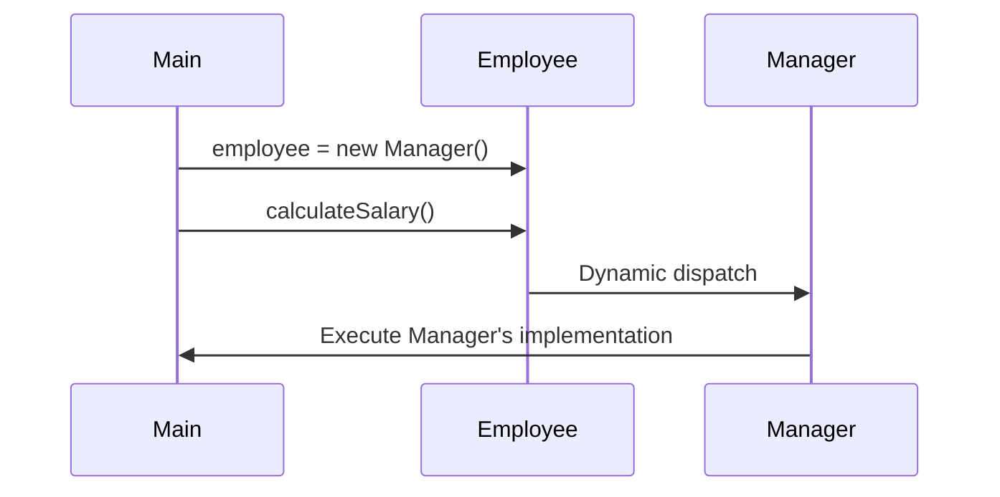
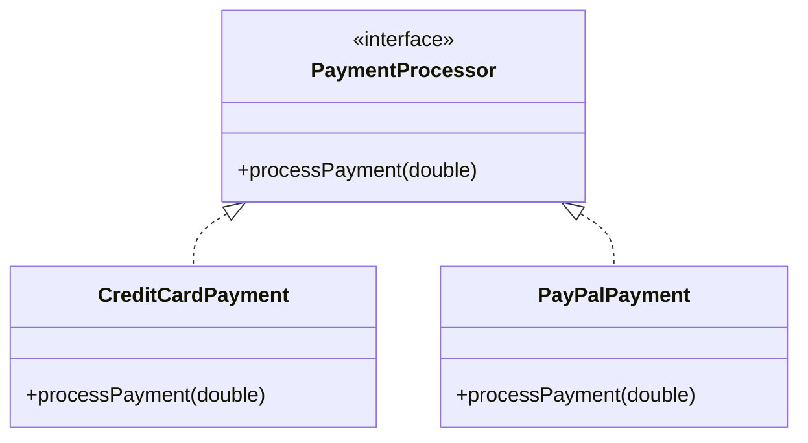

I'll create a comprehensive lab on Java Polymorphism following a similar structure to the provided sample.


# Java Polymorphism Lab

## Table of Contents
1. [Definition and Basics of Polymorphism](#1-definition-and-basics-of-polymorphism)
2. [Compile-time Polymorphism](#2-compile-time-polymorphism)
3. [Runtime Polymorphism](#3-runtime-polymorphism)
4. [Method Signatures](#4-method-signatures)
5. [Benefits of Polymorphism](#5-benefits-of-polymorphism)

## Lab Setup
1. Create a package called `ie.atu.polymorphism`
2. Create a `Main` class inside this package
3. Place all the below classes from the DIY sections into this package

## 1. Definition and Basics of Polymorphism

### Learning Objective
Understand polymorphism in Java and how it enables objects to take multiple forms, enhancing code flexibility and reusability.

### Explanation
Polymorphism, meaning "many forms," is a core principle of object-oriented programming that allows objects to be treated as instances of their parent class. It enables you to perform a single action in different ways and lets you invoke methods of derived classes through base class references during runtime.

### Example
```java
public class Shape {
    public void draw() {
        System.out.println("Drawing a shape");
    }
}

public class Circle extends Shape {
    @Override
    public void draw() {
        System.out.println("Drawing a circle");
    }
}

public class Square extends Shape {
    @Override
    public void draw() {
        System.out.println("Drawing a square");
    }
}
```

### Visual Representation


### DIY Exercise: Animals
1. Create a base class Animal with:
   - Method makeSound() that prints "Animal makes a sound"
2. Create two subclasses: Cat and Dog that override makeSound()
3. In your Main class:
   - Create an array of Animal references
   - Assign different animal objects to it
   - Call makeSound() on each object

## 2. Compile-time Polymorphism

### Learning Objective
Understand method overloading as a form of compile-time polymorphism and how it allows multiple methods with the same name but different parameters.

### Explanation
Compile-time (static) polymorphism occurs through method overloading. Methods can have the same name but different parameters, allowing multiple ways to invoke similar functionality. The compiler determines which method to call based on the arguments provided.

### Example
```java
public class Calculator {
    public int add(int a, int b) {
        return a + b;
    }

    public double add(double a, double b) {
        return a + b;
    }

    public int add(int a, int b, int c) {
        return a + b + c;
    }
}
```

### Visual Representation


### DIY Exercise: Printer
Create a class Printer with overloaded print methods:
- print(String message)
- print(String message, int copies)
- print(String message, String color)

## 3. Runtime Polymorphism

### Learning Objective
Understand method overriding and dynamic method dispatch in runtime polymorphism.

### Explanation
Runtime (dynamic) polymorphism occurs through method overriding, where a subclass provides a specific implementation of a method declared in its superclass. The JVM determines which method to call at runtime based on the actual object type.

### Example
```java
public class Employee {
    public void calculateSalary() {
        System.out.println("Calculating base salary");
    }
}

public class Manager extends Employee {
    @Override
    public void calculateSalary() {
        System.out.println("Calculating salary with bonus");
    }
}

public class Developer extends Employee {
    @Override
    public void calculateSalary() {
        System.out.println("Calculating salary with overtime");
    }
}
```

### Visual Representation


### DIY Exercise: Vehicles
Create a hierarchy of vehicles with different behaviors:
1. Base class Vehicle with method start()
2. Subclasses Car and Motorcycle that override start()
3. Demonstrate runtime polymorphism using Vehicle references

## 4. Method Signatures

### Learning Objective
Understand what constitutes a method signature and its importance in polymorphism.

### Explanation
A method signature consists of:
- Method name
- Parameter types and order
- Number of parameters

Return type is not part of the method signature. Method signatures are crucial for both overloading and overriding.

### Example
```java
public class MethodSignatureExample {
    // Different signatures
    public void process(int x) { }
    public void process(String s) { }
    public void process(int x, String s) { }
    
    // Same signature (won't compile)
    // public int process(int x) { return x; }
}
```

### DIY Exercise: Method Signatures
Create a class with various method signatures:
- Multiple methods named "calculate" with different parameters
- Document why each signature is unique
- Try to create invalid signatures and note the compiler errors

## 5. Benefits of Polymorphism

### Learning Objective
Understand the advantages of using polymorphism in Java applications.

### Explanation
Polymorphism provides several benefits:
1. Code reusability
2. Flexibility in adding new types
3. Cleaner and more maintainable code
4. Runtime method selection
5. Simplified programming interface

### Example
```java
public interface PaymentProcessor {
    void processPayment(double amount);
}

public class CreditCardPayment implements PaymentProcessor {
    @Override
    public void processPayment(double amount) {
        System.out.println("Processing credit card payment");
    }
}

public class PayPalPayment implements PaymentProcessor {
    @Override
    public void processPayment(double amount) {
        System.out.println("Processing PayPal payment");
    }
}
```

### Visual Representation


### DIY Exercise: Shopping Cart
Create a shopping cart system that demonstrates polymorphism benefits:
1. Create an interface Product
2. Create multiple product types implementing the interface
3. Create a ShoppingCart class that can handle any product type

## Summary
- Definition and types of polymorphism
- Compile-time vs Runtime polymorphism
- Method signatures and their role
- Benefits and practical applications of polymorphism

## Further Reading
- Java Documentation: Polymorphism
- Book: Head First Java
- Book: Clean Code by Robert C. Martin
- Online Resource: Polymorphism in Java - Baeldung

Remember to test all your implementations and understand how different types of polymorphism affect your program's behavior. Happy coding!
