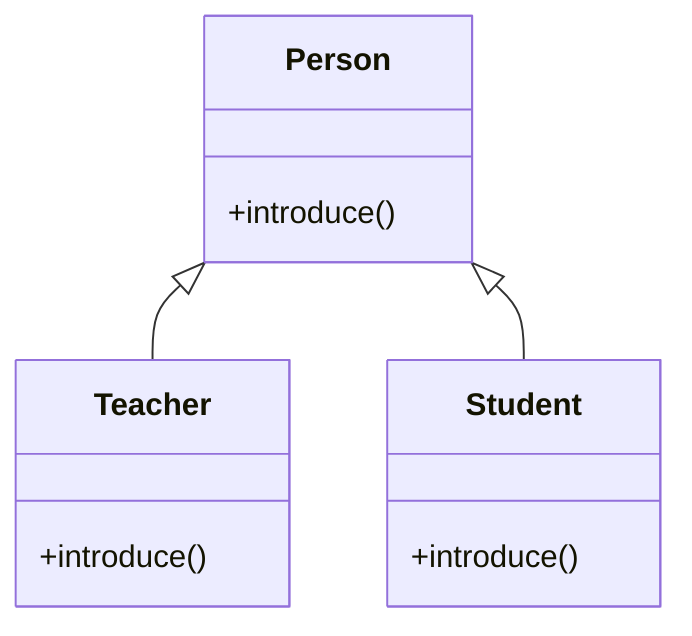
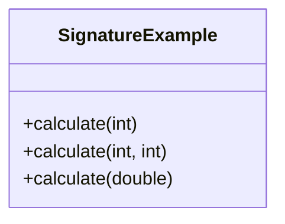
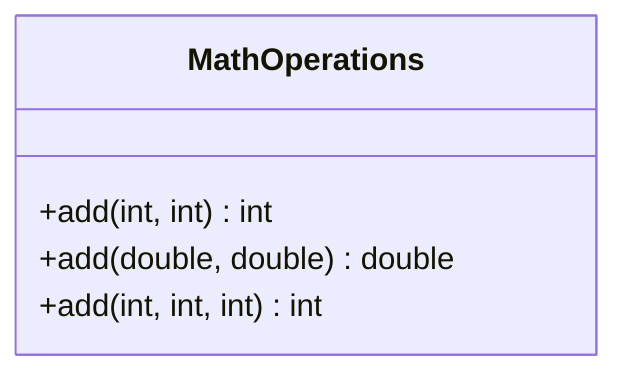
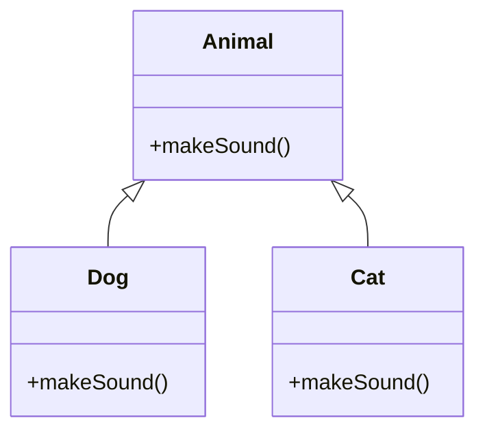

# Java Polymorphism Lab

## Table of Contents
1. [Definition and Basics of Polymorphism](#1-definition-and-basics-of-polymorphism)
2. [Method Signatures](#2-method-signatures)
3. [Compile-time Polymorphism](#3-compile-time-polymorphism)
4. [Runtime Polymorphism](#4-runtime-polymorphism)
5. [Benefits of Polymorphism](#5-benefits-of-polymorphism)

## Lab Setup
1. Create a package called `ie.atu.polymorphism`
2. Create a `Main` class inside this package
3. Place all the below classes from the DIY sections into this package

## 1. Definition and Basics of Polymorphism

### Learning Objective
Understand the concept of polymorphism in Java and how it allows objects to take multiple forms, making programs more flexible and reusable.

### Explanation
Polymorphism, which means "many forms" in Greek, is one of the fundamental principles of object-oriented programming. It allows us to perform a single action in different ways. Think of it like a musical instrument - a guitar can produce different sounds depending on how it's played, but it's still the same guitar. In Java, this means an object can behave differently based on the context in which it's used.

There are two main types of polymorphism in Java:
1. Compile-time polymorphism (Static binding)
2. Runtime polymorphism (Dynamic binding)

### Example
```java
public class Person {
    public void introduce() {
        System.out.println("Hello, I am a person");
    }
}

public class Teacher extends Person {
    @Override
    public void introduce() {
        System.out.println("Hello, I am a teacher");
    }
}
```

### Visual Representation


### DIY Exercise: Roles
1. Create a base class Person with:
   - Method greet() that prints "Hello"
2. Create two subclasses: Teacher and Student
3. In your Main class:
   - Create instances of each class
   - Call greet() on each instance

## 2. Method Signatures

### Learning Objective
Understand what constitutes a method signature in Java and why it's important for method declaration and identification.

### Explanation
A method signature is like a fingerprint for a method - it uniquely identifies the method within its class. Just as we identify a person by their unique characteristics, Java identifies methods by their signatures. This concept is fundamental to understanding both types of polymorphism.

A method signature includes:
- Method name
- Number of parameters
- Type of parameters
- Order of parameters

Important note: These are NOT part of the method signature:
- Return type
- Parameter names
- Access modifiers (public, private, etc.)

### Example
```java
public class SignatureExample {
    // Different signatures
    public void calculate(int x) {
        System.out.println("One integer parameter: " + x);
    }
    
    public void calculate(int x, int y) {
        System.out.println("Two integer parameters: " + x + ", " + y);
    }
    
    public void calculate(double x) {
        System.out.println("One double parameter: " + x);
    }
    
    // This won't compile - same signature as first method
    // public int calculate(int x) { return x; }
}
```

### Visual Representation


### DIY Exercise: Understanding Signatures
Create a class Calculator with methods that demonstrate:
1. Same name but different parameter count (add(int x) and add(int x, int y))
2. Same name but different parameter types (multiply(int x) and multiply(double x))
3. Same name and parameter types but different order (divide(int x, double y) and divide(double y, int x))

## 3. Compile-time Polymorphism

### Learning Objective
Understand method overloading as a form of compile-time polymorphism and how the compiler resolves method calls.

### Explanation
Compile-time polymorphism, also known as static binding or method overloading, occurs when multiple methods in the same class have the same name but different signatures. The compiler determines which method to call based on the arguments provided during the method call.

### Example
```java
public class MathOperations {
    // Method overloading examples
    public int add(int a, int b) {
        return a + b;
    }

    public double add(double a, double b) {
        return a + b;
    }

    public int add(int a, int b, int c) {
        return a + b + c;
    }
}
```

### Visual Representation


### DIY Exercise: MessageFormatter
Create a class MessageFormatter with overloaded format methods:
1. format(String message) - returns message in uppercase
2. format(String message, boolean uppercase) - returns message in upper or lowercase
3. format(String message, String prefix) - returns message with prefix

## 4. Runtime Polymorphism

### Learning Objective
Understand method overriding and dynamic method dispatch in runtime polymorphism.

### Explanation
Runtime polymorphism, also known as dynamic binding or method overriding, occurs when a subclass provides a specific implementation of a method that is already defined in its superclass. The JVM determines which method to call at runtime based on the actual object type, not the reference type.

### Example
```java
public class Animal {
    public void makeSound() {
        System.out.println("Animal makes a sound");
    }
}

public class Dog extends Animal {
    @Override
    public void makeSound() {
        System.out.println("Dog barks");
    }
}

public class Cat extends Animal {
    @Override
    public void makeSound() {
        System.out.println("Cat meows");
    }
}
```

### Visual Representation


### DIY Exercise: Shapes
Create a hierarchy of shapes:
1. Base class Shape with method calculateArea()
2. Subclasses Circle and Rectangle that override calculateArea()
3. Demonstrate runtime polymorphism using Shape references

## 5. Benefits of Polymorphism

### Learning Objective
Understand the advantages of using polymorphism in Java applications and how it improves code design.

### Explanation
Polymorphism provides several key benefits:
1. Code reusability - Write methods that can work with objects of multiple types
2. Flexibility - Easy to add new types without changing existing code
3. Simplified programming - Treat different objects uniformly
4. Improved code organization - Better structure through inheritance hierarchies
5. Maintainability - Changes in one place affect all related classes

### Example
```java
public class Shape {
    public double getArea() {
        return 0.0;
    }
}

public class Rectangle extends Shape {
    private double length;
    private double width;

    @Override
    public double getArea() {
        return length * width;
    }
}

// Using polymorphism
Shape[] shapes = new Shape[3];
shapes[0] = new Rectangle();
shapes[1] = new Circle();
shapes[2] = new Triangle();

// Calculate total area
double totalArea = 0;
for(Shape shape : shapes) {
    totalArea += shape.getArea(); // Polymorphic method call
}
```

### DIY Exercise: Drawing Application
Create a simple drawing application that demonstrates polymorphism benefits:
1. Create a base class Shape with draw() method
2. Create different shape classes (Circle, Square, Triangle)
3. Create a DrawingBoard class that can work with any shape

## Summary
- Understanding of polymorphism and its types
- Method signatures and their components
- Compile-time polymorphism through method overloading
- Runtime polymorphism through method overriding
- Practical benefits of using polymorphism

## Further Reading
- Java Documentation: Polymorphism
- Book: Head First Java
- Book: Clean Code by Robert C. Martin
- Online Resource: Baeldung - Polymorphism in Java

End of Lab
---
